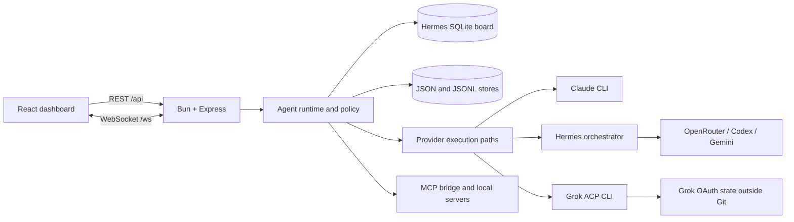
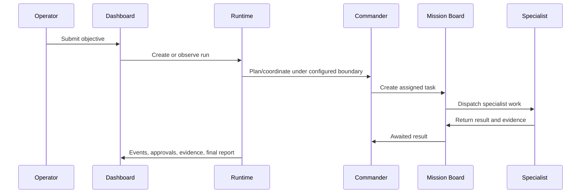

# Architecture

## Scope

This webapp subtree contains the ChillsPwn dashboard and agent-runtime application. The outer private recovery repository also retains Hermes source and selected runtime files, sanitized personas, report templates, deployment units, and a restore helper. Provider authentication, live operational state, engagement data, and optional security-tool/MCP installations remain external by design.

The application therefore has two practical operating levels:

1. **Portable application mode:** install dependencies, run typechecks/tests, build the client, and start the HTTP server.
2. **Integrated operator mode:** add the external contracts in [Integrations](integrations.md) to enable personas, provider execution, Mission Board persistence, reports, memory, and security tooling.

## System context

## Browser application

`index.html` loads `src/main.tsx`, which mounts `src/App.tsx`. The app lazy-loads pages for chat, Mission Board, agent cockpit, reports, logs, settings, files, system state, and specialized workflows.

During development, Vite listens on port 3132 and proxies `/api` and `/ws` to the Bun server on port 3131. In a production build, the Bun server serves `dist/` and the API from the same origin.

## Server application

`server/index.ts` owns the Express application, WebSocket lifecycle, static serving, provider process management, and several legacy routes. Newer capabilities are split into modules:

- `server/runtime/`: run lifecycle, planning, policy, approvals, evidence, artifacts, reports, memory, and process shutdown.
- `server/agents/`: specialist roster, routing, assignment, personas, and Mission Board logic.
- `server/providers/`: provider abstractions and the Grok ACP boundary/runtime.
- `server/mcp/`: MCP registry, execution policy, and arsenal bridge.
- `server/routes/`: extracted API route groups.
- `server/security/`: startup configuration, authentication, safe paths, and legacy obfuscation controls.
- `server/assets/`: wordlist, hashcat, and vulnerability-intelligence catalogs.

`server/index.ts` remains a large legacy composition root and is intentionally excluded from strict TypeScript checking. Modular server code is checked by `tsconfig.server.json`; `bun run check:server-entry` parses and bundles the production entry so syntax and import-graph failures cannot bypass validation. This bundle check is not a substitute for bringing the composition root under strict typing; reducing and typing it remains technical debt.

## Run and delegation flow

The exact enforcement boundary depends on the provider path. Grok commander ACP uses an isolated profile, an attested tool surface, and a fail-closed pre-tool guard. Other provider paths may be managed, gated, or observe-only as documented in `SECURITY.md` and the runtime flags.

## Persistence

The application reads and writes state outside the repository. In the integrated recovery deployment the explicit systemd variables below are authoritative; local runs use the same defaults derived from `HERMES_HOME` and `CHILLSPWN_STATE_DIR`:

- `${HERMES_HOME:-$HOME/.hermes}/kanban.db`: Mission Board SQLite data (the integrated units set `HERMES_HOME=/root/.hermes`).
- `CHILLSPWN_STATE_DIR` (default: the `chillspwn` child of `HERMES_HOME`): runtime data, logs, reports, artifacts, and UI state.
- `CHILLSPWN_PERSONAS_DIR` (default: the `personas` child of `CHILLSPWN_STATE_DIR`): deployed persona JSON and Soul state.
- `CHILLSPWN_SESSIONS_DIR` (default: the `sessions` child of `CHILLSPWN_STATE_DIR`): ChillsPwn session records.
- `${HERMES_HOME:-$HOME/.hermes}`: Hermes configuration, conversations, protected reusable memory, scripts, provider profiles, and other Hermes state.
- Workspace/engagement roots configured by `ALLOWED_WORKSPACE_ROOTS`. The same ordered roots drive file browsing, engagement APIs and working directories, interactive Claude `--add-dir` access, and OSINT output placement.

These paths may contain credentials and target data. They must never be copied into the Git worktree. See [Data and migrations](data-and-migrations.md) and [Operations](operations.md).

## Security boundaries

- The server binds to loopback by default.
- Non-loopback exposure fails closed without a dashboard token unless an explicit unsafe escape hatch is enabled.
- Terminal, proxy, file-write, security-tool, and MCP execution are independent feature gates.
- File, engagement, report, and OSINT artifact routes are confined to configured workspace roots with real-path/no-follow checks. Persisted OSINT control state and worker stdout/stderr live separately under the `osint-jobs` child of `CHILLSPWN_STATE_DIR`; state/artifact reads and stdout tail reads use bounded no-follow helpers.
- API secrets are injected by systemd from root-owned mode-`0600` environment files that the service account cannot reopen. Refreshable provider OAuth stores remain narrowly service-owned where the CLI must update them.
- Provider children receive explicit provider-specific environment subsets. Because they still share the dashboard's UID, this prevents accidental inheritance but is not strong process isolation; same-UID `/proc` access and service-readable OAuth stores remain residual risks.
- Reusable memory is root-only and reached through the validated `chillspwn-memory.service` Unix-socket broker; model-facing processes do not receive direct filesystem access to it.
- The Grok ACP commander receives a reduced environment and OAuth credential path, not an API key value.

The detailed application threat model is in [SECURITY.md](../SECURITY.md).

## Current technical decisions and debt

- **Bun is canonical.** `bun.lock` is the only JavaScript dependency lockfile.
- **External live state is intentional.** The outer recovery repository packages reviewed source and sanitized runtime contracts, but never credentials, databases, conversations, memories, logs, or engagement data.
- **Deployment is manual.** CI validates source but does not deploy.
- **Android native source is retained.** Gradle output and `android/app/src/main/assets/` are generated and ignored; reproducible signed mobile release work remains future scope.
- **No formatter baseline yet.** Repository-wide formatting should be introduced separately from behavior changes.
- **No versioned database migrations yet.** Startup performs limited additive schema checks, while the base board schema remains external.
