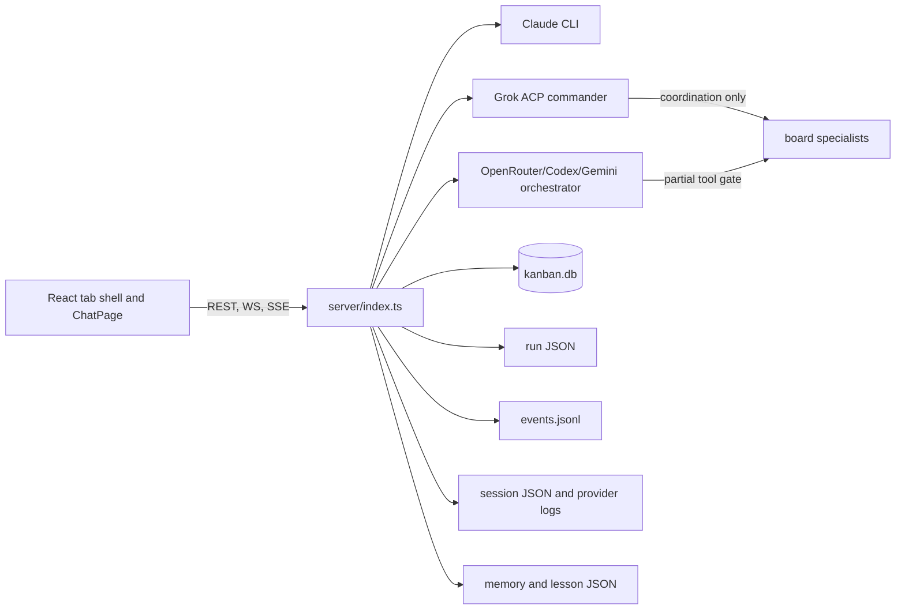
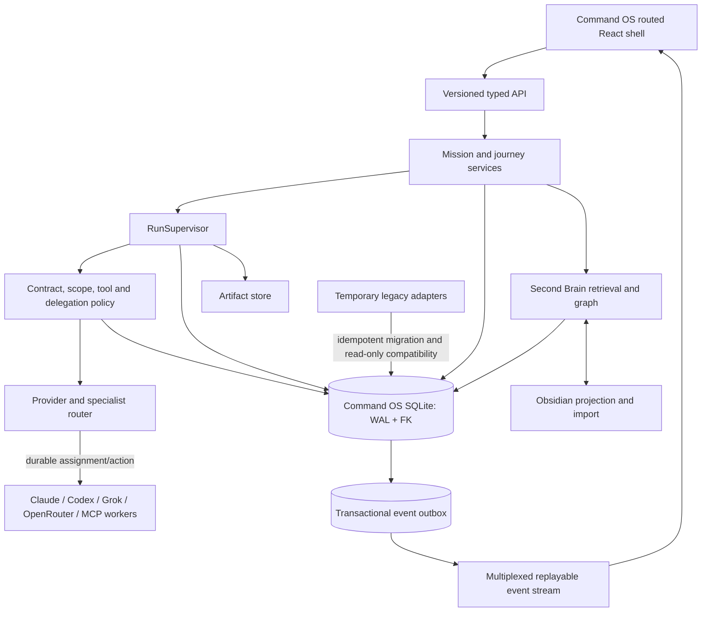

# Architecture map

The “current” diagram below is the characterized legacy baseline. The target
diagram is substantially implemented in the recovery worktree, with remaining
cutover and acceptance gaps tracked in
[`completion-gap-audit.md`](completion-gap-audit.md).

## Current control flow

The current provider paths do not share one durable Assignment/Action boundary. Runtime state and emitted history can diverge because their writes are independent.

## Target V2.1 architecture

## Ownership rules

- Mission owns objective, authorization, journey, scope, constraints, and continuity.
- Run owns one execution attempt, state machine, budgets, checkpoint, and evaluation.
- Plan and Step own intended work; Assignment names the specialist owner.
- Action owns every provider turn/tool/delegation/operator decision.
- The supervisor is the only component allowed to advance active run state.
- Policy is evaluated at action time against the versioned contract or exact Guided decision.
- SQLite is the transactional source of truth. The event stream is produced from its outbox.
- Artifacts retain large bodies; SQLite retains hashes, provenance, retention, and links.
- The Obsidian vault is a versioned human-readable projection, never mission-state authority.

## Compatibility boundary

Legacy session, board, runtime, memory, and report reads remain available behind
adapters until migration reconciliation succeeds. Their mutations, WebSocket
execution commands, and background workers are default-off behind
`ENABLE_LEGACY_EXECUTION_API`; enabling it is a visible, degraded, time-bounded
rollback state. New code must not create a second permanent source of truth.
The audited route and worker inventory is documented in
[`legacy-execution-boundary.md`](legacy-execution-boundary.md).
