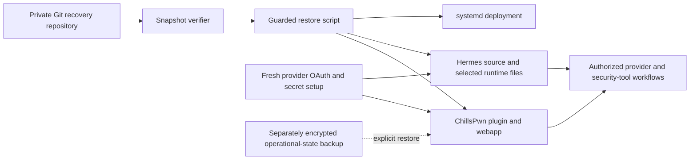

# Recovery architecture

## Purpose and boundaries

The repository reconstructs application source and sanitized runtime configuration on a clean Linux host. It deliberately does not reconstruct identity or engagement state. OAuth stores, API credentials, operational database records, conversations, memories, logs, loot, and client evidence must come from separate secure systems. Recovery initializes an empty Mission Board database from retained source; it does not restore a captured database or any cards.

The dashed operational-state path is never automatic. A maintainer must verify consistency, authorization, and encryption before restoring it.

## Module ownership

| Path | Responsibility | Restore destination |
|---|---|---|
| `chillspwn/plugin/` | Claude plugin, dashboard, server, personas, providers, tests | `/opt/chillspwn/plugin` |
| `chillspwn/runtime/` | Sanitized active persona and skill routing | `/root/.hermes/chillspwn` |
| `chillspwn/report-template/` | Report generator, templates, and required assets | `/root/report-template` |
| `hermes/source/` | Hermes Agent source snapshot | `/opt/chillspwn/hermes-agent` |
| `hermes/runtime/` | Selected Soul, skills, scripts, and cron definitions | `/root/.hermes` |
| `deployment/systemd/` | Memory broker, dashboard, Hermes gateway, and reviewed environment drop-in | `/etc/systemd/system` |
| `scripts/` | Snapshot policy and guarded restore orchestration | Run from repository |

Application-level module and request flows are documented in [the ChillsPwn architecture guide](../chillspwn/plugin/webapp/docs/architecture.md).

## Configuration and contracts

The tracked environment templates contain variable names and secure placeholders only. The restore process does not synthesize secrets. Provider authentication is recreated interactively after source restoration, and Hermes provider configuration is regenerated using its installed CLI. Live environment files are root-owned mode `0600` with no service ACL. systemd reads them before dropping to `chillspwn`; application code consumes the inherited environment, direct provider children receive explicit subsets, and individual Council lanes receive provider-aware subsets from their multi-provider launcher. This prevents direct runtime-file reads and reduces accidental inheritance, but it does not create a security boundary between processes that share the service UID.

The principal cross-component contracts are:

- the dashboard's persona files and Hermes Mission Board schema;
- provider CLI/ACP process contracts, including Grok's OAuth path and commander boundary;
- MCP board and conversation servers supplied by the deployed Hermes skill tree;
- the systemd service account, filesystem ownership, and ACL needed for provider access; and
- external encrypted backups for database and runtime history.

The optional legacy dashboard `.env` and canonical Hermes `.env` are ordered systemd `EnvironmentFile` inputs, with the canonical file taking precedence. They are not application-readable runtime state. OAuth token stores that must refresh atomically remain narrowly service-owned; reviewed executable, plugin, manifest, memory-policy, and broker code remains root-owned. `config.yaml` must contain only non-secret configuration or environment references: a root-owned validator runs during recovery and before both services start, rejecting common literal-secret structures without echoing values.

The residual credential risk is explicit: dashboard/provider processes currently share `chillspwn`, so allowlisted child environments do not prevent a compromised child from probing same-UID `/proc` state or OAuth stores. The structural config validator also cannot identify every secret disguised inside arbitrary free-form text. Separate provider UIDs plus a narrowly scoped credential broker would be required for strong provider-to-provider isolation.

Reviewed application code and provider executables are separate from mutable state. The plugin is root-owned below `/opt/chillspwn/plugin`; ChillsPwn state is below `/root/.hermes/chillspwn`; Grok OAuth state is below `/root/.hermes/auth/grok`; and the service launches only the root-owned absolute executable `/opt/chillspwn/bin/grok`. No runtime path depends on the legacy `/root/.claude` plugin tree or the installer-managed executable below `/root/.grok`.

Reusable memory has a stronger boundary than ordinary runtime state. The service account has no traversal, read, or write permission below `/root/.hermes/memories`. The dashboard and gateway call a root-owned client over the group-restricted `/run/chillspwn-memory/broker.sock`; the hardened `chillspwn-memory.service` exposes only validated additive writes and policy-filtered reads. Root-only curator operations are deliberately absent from the socket protocol.

MCP code, configuration, the application manifest, configured working directories, and resolved executables are also root-controlled. The service may write only `/root/.hermes/chillspwn/mcp-runtime`; enabled MCP entries with a writable or untrusted launch path are classified non-runnable before execution.

See [configuration](../chillspwn/plugin/webapp/docs/configuration.md), [integrations](../chillspwn/plugin/webapp/docs/integrations.md), and [data and migrations](../chillspwn/plugin/webapp/docs/data-and-migrations.md).

## Deployment and rollback

`scripts/restore.sh` verifies the snapshot before writing, refuses populated destinations unless `--force` is explicit, installs dependencies only when requested, and enables systemd only when requested. Dependency installation uses the lockfile's curated `all` extra, normalizes the staged virtualenv for read/execute access, and proves the service identity can execute its interpreter and import Hermes before the atomic venv swap. It then runs Hermes's retained Kanban initializer and ChillsPwn's additive migration as that identity, followed by schema integrity and CRUD inside a transaction that is always rolled back. It does not restore credentials or operational database content from Git.

Before an in-place recovery, the memory broker, dashboard, and gateway states are recorded and active writers are quiesced before source backup or schema migration. Whenever a Mission Board already exists, it is captured with SQLite's online backup API into the local mode-`0700` recovery directory, then checked for integrity and hashed. Units that were running are restarted only after validation, while their prior enablement state remains unchanged; explicit `--enable-service` is the operator override that enables and starts all three. A forced restore installs the reviewed unit definitions without silently changing their enablement. A failed restore leaves the writers stopped for deterministic rollback.

For rollback:

1. Keep the memory broker, dashboard, and gateway stopped and locate the dated local recovery directory printed by the helper.
2. Verify the Mission Board backup against its SHA-256 and `PRAGMA quick_check`.
3. Restore source/configuration paths and the database from that same recovery point, excluding stale SQLite WAL/SHM sidecars.
4. Reapply database ownership/mode and the service states recorded in `service-state.tsv`.
5. Repeat portable and live validation before re-enabling traffic.

Do not use Git history as an operational database rollback mechanism. Follow the application migration guidance for state changes.

## Operational considerations

- Keep the GitHub repository private and restrict administrative access.
- Run the verifier, exact staged-diff review, secret scans, typechecks, tests, and build before pushing.
- Keep the dashboard loopback-bound unless strong token authentication and network controls are configured.
- Treat provider CLI upgrades as integration changes and repeat ACP/tool-boundary tests.
- Regenerate Android web assets from reviewed source; do not preserve deployment-specific generated output.
- Monitor service logs locally, but never attach raw logs to GitHub without redaction.
- Back up live SQLite state consistently and encrypt it client-side with a key held separately.

## Technical decisions

- **Curated snapshot instead of source-history aggregation.** This limits accidental retention of old test material and engagement artifacts while preserving upstream base-commit provenance.
- **Credentials and operational state stay external.** A repository compromise must not directly yield provider access or client data.
- **Executable and OAuth ownership are split.** Grok code is root-owned under `/opt`; only its private refreshable OAuth directory is owned by the service. An absolute `GROK_BIN` prevents `PATH` lookup from crossing back into mutable installer state.
- **Reusable memory crosses a broker, not the filesystem.** Root-only memory files prevent same-UID terminal and native-tool bypass. A narrow Unix-socket service permits only validated addition and safe-read operations.
- **Mission Board recovery starts from code, not captured data.** A clean host receives the canonical Hermes schema plus ChillsPwn's additive columns; transaction-rolled-back smoke checks prove the service can use it without persisting test records.
- **Forced migration has a local rollback point.** Systemd writers are quiesced first, and SQLite online backup plus a checksum protects the pre-migration board without ever placing it in Git.
- **One pinned Hermes interpreter serves every Python process lane.** Both units and the dashboard's orchestrator/council spawns use `/root/hermes-venv/bin/python`, verified as the service identity before installation.
- **Private visibility is mandatory.** Existing historical recovery commits contain infrastructure details and are not approved for public release.
- **Generated Android assets are excluded.** Native project source is sufficient for recovery and avoids persisting stale endpoints or QR codes.
- **Bun is authoritative for the webapp.** `bun.lock` is retained and the stale npm lockfile is removed.
- **No deployment workflow is automated through GitHub.** The deployment target, approval boundary, and secret-management design are host-specific; restoration remains an explicit operator action.
- **Dependency automation follows the restored runtime.** Dependabot covers the active ChillsPwn Bun lock, the Hermes Python/uv lock, and GitHub Actions. Retained auxiliary Hermes npm subprojects are not installed by the recovery helper and are refreshed with the upstream Hermes snapshot rather than independently mutated here.
- **No repository-wide license is inferred.** ChillsPwn and retained third-party components have different provenance and require an explicit licensing decision before redistribution.
