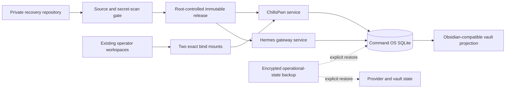

# Recovery architecture

## Purpose and boundaries

This private repository preserves reviewed application source, sanitized runtime
seeds, unit templates, and recovery documentation. It deliberately excludes
provider credentials, OAuth tokens, databases, conversations, logs, memories,
loot, and engagement evidence. Those come only from separately encrypted and
access-controlled backups.



The dashed paths are never automatic. A maintainer verifies identity,
authorization, checksums, consistency, and encryption before restoring them.

## Module ownership

| Repository path | Responsibility | Recovery destination |
|---|---|---|
| `chillspwn/plugin/` | Plugin, dashboard, server, personas, providers, tests | `/opt/chillspwn/releases/<release-id>/plugin`, exposed through `/opt/chillspwn/plugin` |
| `chillspwn/report-template/` | Report generator, templates, and assets | `/opt/chillspwn/report-template` |
| `hermes/source/` | Hermes source snapshot used to build the pinned environment | `/opt/chillspwn-runtime/hermes-venv` and optional reviewed source archive |
| `hermes/runtime/` | Sanitized Hermes state/configuration seeds | imported deliberately below `/var/lib/chillspwn/hermes`; never treated as credentials |
| `deployment/systemd/` | Dashboard, gateway, and workspace mount units | `/etc/systemd/system` |
| `scripts/` | Snapshot validation plus retained legacy recovery tooling | run only according to the V2 recovery warning |

Root-controlled executable/code boundaries include the immutable release, Bun,
Hermes virtual environment, Grok executable, report template, and systemd units.
Mutable runtime state is service-owned below `/var/lib/chillspwn`; secrets remain
in root-owned mode-`0600` environment files under `/etc` or in narrowly
service-owned refreshable OAuth stores.

## Canonical state and memory

`/var/lib/chillspwn/command-os-v2.sqlite` is transactional authority for
missions, runs, plans, steps, events, evidence, findings, checkpoints,
evaluations, lessons, conversations, and Second Brain graph state. The
Obsidian-compatible tree below `/var/lib/chillspwn/brain-vaults` is a
synchronized human-readable projection/import surface.

The V2.1 service graph has no root memory-broker dependency. Memory controls are
implemented by canonical repositories, scope/sensitivity/consent policy,
context packs, lifecycle transitions, usage audit, and forgetting semantics.
No secret, private key, session token, or raw confidential payload belongs in
reusable memory.

## Service and provider isolation

Both application services run as `chillspwn` with an explicitly empty
supplementary-group set, empty capability sets, and `NoNewPrivileges=true`.
They use `HOME=/home/chillspwn`; provider locations are explicit under
`/var/lib/chillspwn`. They never require a root HOME, passwordless sudo, or
general `/root` traversal.

Provider-specific child environment allowlists reduce accidental credential
inheritance, but shared-UID processes are not a strong provider-to-provider
security boundary. Deploy separate provider UIDs and a narrow credential broker
if the threat model requires that isolation.

Docker access is deliberately excluded. Docker group/socket access is
root-equivalent, and `MCP_ARSENAL_ALLOW_DOCKER=false` is part of the supported
host contract. MCP executable/configuration paths remain root-controlled;
writable runtime output goes only to reviewed state paths.

## Workspace bridge

Existing operator data remains at `/root/htb/boxes` and `/root/engagements`.
The tracked mount units bind those directories to:

```text
/var/lib/chillspwn/workspaces/htb/boxes
/var/lib/chillspwn/workspaces/engagements
```

Only the target paths enter `ALLOWED_WORKSPACE_ROOTS`. This avoids granting the
service general `/root` traversal while preserving existing data and stable
operator paths. Every recovery records source/target identity and ACLs, and
verifies access as the service account.

## Deployment and rollback

Recovery stages an immutable release, preserves the prior release, backs up and
reconciles the canonical database, installs the mount units before application
units, and starts Hermes before ChillsPwn. A deployment is accepted only after
source, migration, permission, provider, journey, cancellation, restart/resume,
memory, vault, and rollback checks pass.

Rollback repoints the release symlink only after writers stop and uses a
checksum-verified schema-compatible database backup. It preserves any newer
evidence/audit data before restoring older state. A prior release that requires
privileged groups, sudo, Docker access, a root HOME, or direct root-memory access
is not a safe rollback target.

See [RECOVERY.md](../RECOVERY.md), the [deployment gate](../chillspwn/plugin/webapp/docs/command-os-v2/deployment.md),
and the [rollback runbook](../chillspwn/plugin/webapp/docs/command-os-v2/rollback.md).

## Technical decisions

- **Immutable release plus external state.** Code and runtimes remain
  root-controlled; application/provider state remains narrowly service-owned.
- **Canonical SQLite, not permanent dual-writing.** Legacy files are imported
  idempotently with provenance and retained only through the rollback window.
- **Obsidian is a projection, not transaction authority.** Atomic sync and
  explicit conflict review protect canonical state.
- **Two unprivileged services.** The legacy root memory broker is absent from
  the V2 service dependency graph.
- **Exact workspace bind mounts.** Existing operator data remains in place
  without broad root-home access.
- **No Docker MCP.** A host-root-equivalent socket is incompatible with the
  service boundary.
- **Private visibility.** Infrastructure and security-operation details are not
  approved for public redistribution.
- **Explicit restore and deployment.** GitHub Actions validates source; host
  promotion, OAuth, migration, and rollback require operator control.
